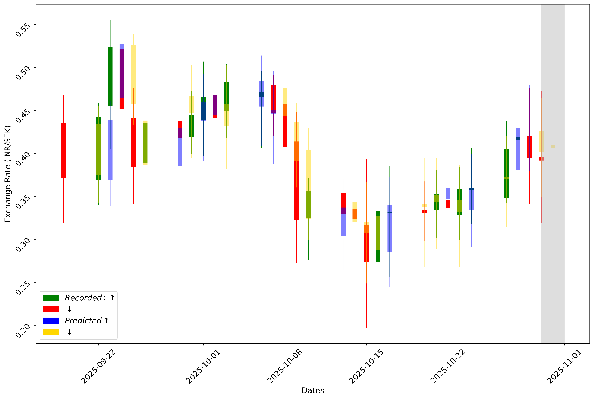

# Exchange Rate Predictor

## Description

- Daily foreign exchange data is pulled from a standard public REST API for the last 100 days.
- The data contains daily `open`, `high`, `low` and `close` rates for the SEK-INR combination.
- A machine learning model based on the LSTM neural network is used for training, validating
and testing all the data available from 2014. The saved model is then used to make predictions
given the latest 30 days data.
- `Tensorflow` is the main driver for bulding the LSTM model.
- Currently the code from model building is not made available but will be once it has been
formatted.
- All the tasks here are automated using `GitHub Actions`. See the `automation.yaml` file.

Monitor SEK - INR currency exchange by pulling data from Alpha Vantage API [RapidAPI](https://rapidapi.com/alphavantage/api/alpha-vantage).
The data is auto-pulled and the candlestick plot is updated everyday using Github Actions workflow.

